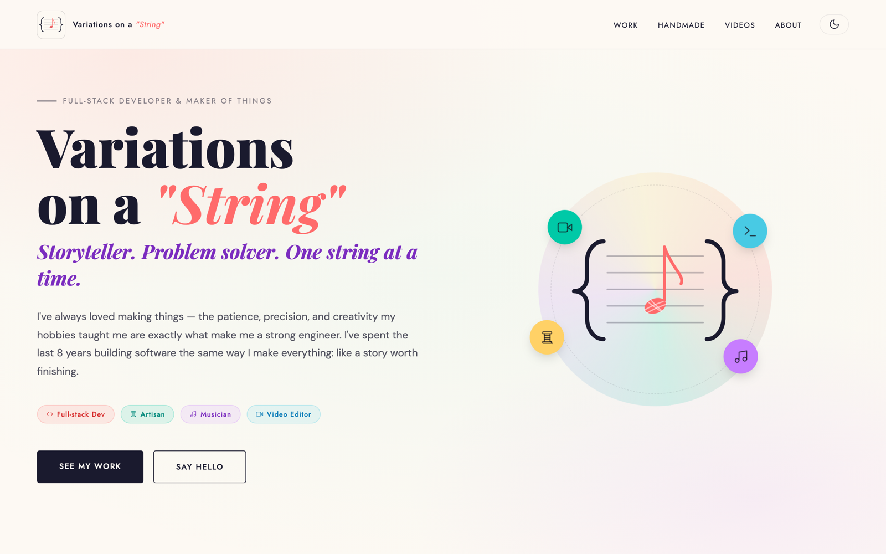

<div align="center">

# Variations on a String

### Storyteller. Problem solver. One string at a time.

My developer portfolio — a fast, dependency-free site built with vanilla **HTML, CSS, and JavaScript**. No framework, no build step, no runtime: the browser loads three static files directly. It showcases my engineering work alongside my creative work as an artisan, musician, and video editor — all in a polished light/dark theme.

[](https://www.variationsonastring.com)




</div>

## Project structure

| File         | Purpose                                                        |
| ------------ | -------------------------------------------------------------- |
| `index.html` | Markup and content only.                                       |
| `styles.css` | All styles. Design tokens (color, type, spacing) live at the top under `:root`; light/dark themes are driven by a `data-theme` attribute. |
| `main.js`    | Progressive enhancement: scroll reveals, dark-mode toggle, creative-work gallery filter, nav, mobile menu. Loaded as a deferred ES module. |
| `og-image.jpg`, `logo.png` | Social preview image and brand mark. |
| `vercel.json` | Zero-build deploy config (serves the repo root as static). |

The initial color theme is applied by a small render-blocking script in
`<head>` so the page never flashes the wrong palette before `styles.css`
and `main.js` load.

## Local development

No tooling required. Open `index.html` directly, or serve the folder so
the ES module loads over HTTP:

```sh
python3 -m http.server 8000
# then visit http://localhost:8000
```

## Deployment

Hosted as a static site (Vercel / GitHub Pages). There is no build
command — every file in the repo root is served as-is. Pushing to `main`
publishes.

## Conventions

- Design changes go through the tokens in `styles.css` `:root`, not
  ad-hoc values, so light and dark modes stay in sync.
- `main.js` is intentionally small and framework-free; keep behaviour
  progressive (the page must remain readable with JS disabled).
- Editor settings are pinned in `.editorconfig`.
